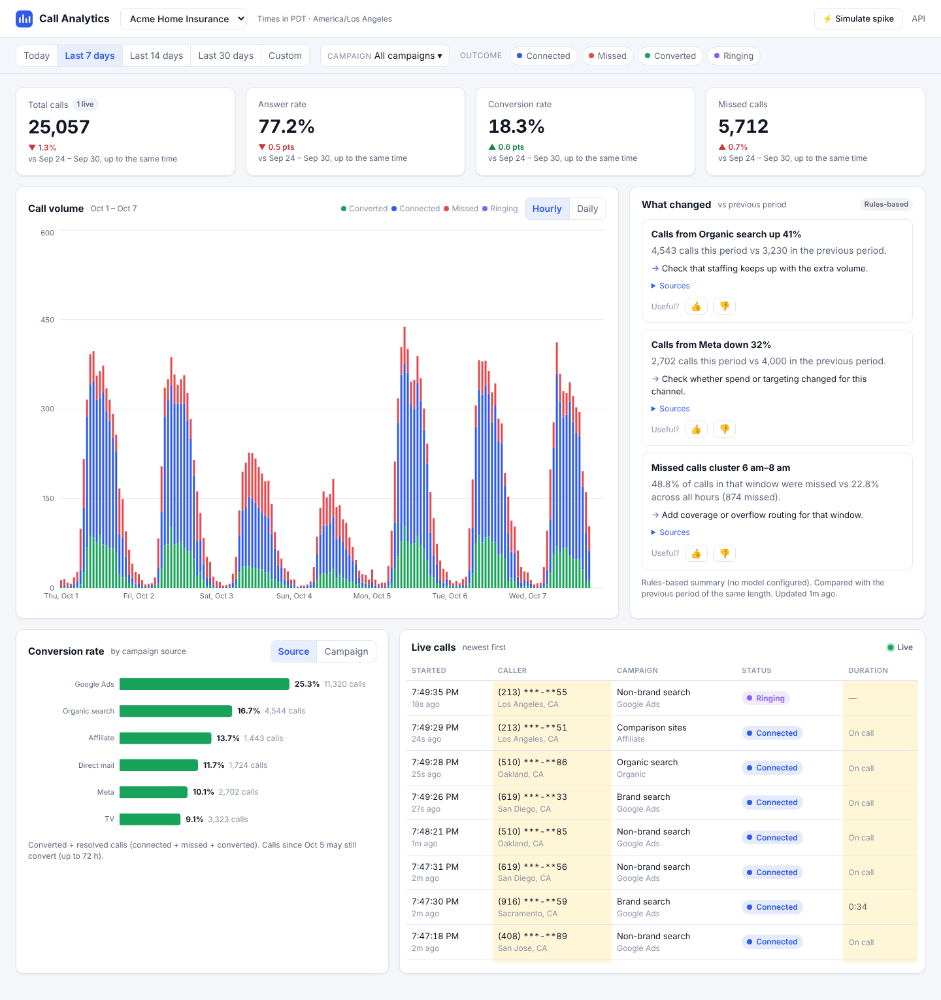
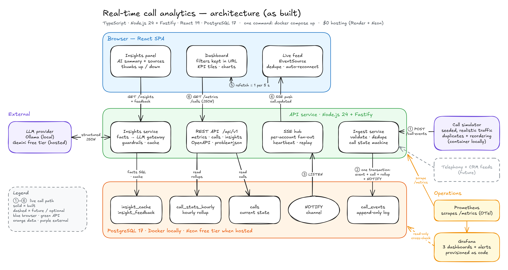

# Real-time call analytics

A real-time call analytics dashboard for a marketing manager. Calls come in from tracking numbers on each campaign. The dashboard shows them **live as they happen**, call volume **by hour and by day**, **conversion rate by campaign source**, and a short **"what changed"** summary written by an AI model. Every number and every up/down in that summary is checked against SQL facts before it is shown.

In Invoca's terms: a *conversion* is a signal (a sale, booking or quote) tied to the campaign and channel that drove the call, and the "what changed" panel is close in spirit to Smart Alerts for missed calls and conversion drops. It says what to check rather than claiming why something happened.

[](https://github.com/umarajPotla/call-analytics-dashboard/actions/workflows/ci.yml)



**Docs:**
- [Design and decisions](docs/DESIGN.md): assumptions, metric definitions, the decision records, the scaling path and the change log
- [Architecture diagrams](docs/diagrams/architecture-diagrams.pdf)
- [Runbook](docs/RUNBOOK.md)
- [Benchmark](docs/benchmarks.md): 9.7M calls across 500 accounts
- API reference at `/api/docs` once the app is running

## Run it

You need Docker. Nothing else.

```bash
git clone https://github.com/umarajPotla/call-analytics-dashboard.git
cd call-analytics-dashboard
docker compose up --build
```

Open **http://localhost:8080**. On first start the simulator loads 14 days of history for three demo brands (about 100k calls, a few seconds). Then it streams live calls. **⚡ Simulate spike** multiplies one brand's traffic 6× for 10 minutes so you can watch the charts move.

| Also try | Command |
|---|---|
| Prometheus, Alertmanager and Grafana: dashboards at http://localhost:3000, alert routing at http://localhost:9093 | `GRAFANA_URL=http://localhost:3000 docker compose --profile observability up --build` |
| AI insights with a local model ([Ollama](https://ollama.com) running on your machine) | `ollama pull llama3.2:3b`, then `LLM_BASE_URL=http://host.docker.internal:11434/v1 LLM_MODEL=llama3.2:3b docker compose up --build` |
| AI insights with Gemini's free tier | `LLM_BASE_URL=https://generativelanguage.googleapis.com/v1beta/openai LLM_MODEL=gemini-3.5-flash LLM_API_KEY=… docker compose up --build` |
| Without Docker (Node 24, pnpm 10, a local Postgres) | `cp .env.example .env`, set `DATABASE_URL`, then `pnpm install && pnpm dev` (API on :8080, dashboard on :5173) |

**Without an AI model the dashboard still works.** The insights panel falls back to a rules-based summary built from the same facts.

## What it does

| Requirement | Where it is |
|---|---|
| Call volume, last 7 days, hourly and daily | *Call volume* chart, Hourly/Daily toggle. Bars are stacked by status. Days and hours are in the account's own time zone, including DST days with 23 or 25 hours |
| Conversion rate by campaign source | *Conversion rate* chart, with a Source/Campaign toggle. Low-volume groups are flagged. Recent days are marked "may still convert" because conversions can arrive up to 72 h late |
| Live feed with status | *Live calls*: Server-Sent Events. Rows update in place as a call rings, connects or is missed, then converts. It reconnects and replays missed updates by itself, and falls back to polling if the stream is blocked |
| Filters: date range, campaign, outcome | Filter bar. Every filter lives in the URL, so a view can be bookmarked or shared |
| API access | Versioned REST under `/api/v1`, with OpenAPI docs at `/api/docs`. The live feed is also an API: `GET …/calls/stream` |
| Beyond the brief | KPI tiles compared like for like with the previous period · AI "what changed" panel with sources and feedback · Grafana dashboards, tested alert rules and Alertmanager routing as code · CI that runs the whole stack |

## Decision summary

*The same text goes in the submission form. The full reasoning, assumptions and change log are in [DESIGN.md](docs/DESIGN.md).*

**What I built.** A dashboard for a marketing manager at one brand: a live feed of calls as they ring, connect, are missed or convert; call volume for the last 7 days by hour and by day; conversion rate by campaign source; KPI tiles vs the previous period; filters for date range, campaign and outcome, kept in the URL; and an AI "What changed" panel with sources. A versioned REST API (OpenAPI at `/api/docs`) serves it, with the live feed as Server-Sent Events, and a simulator sends realistic traffic through the same ingest API a telephony system would use. It runs with `docker compose up`, which is also how CI starts and tests it. With no kickoff call, I wrote the open questions down as assumptions: *converted* is the brand's business outcome (like an Invoca signal), arriving up to 72 h after the call and credited to it; *conversion rate* is converted ÷ resolved calls; *last 7 days* means calendar days in the account's time zone.

**Key trade-offs**
- **PostgreSQL only:** an event log, each call's current state and hourly rollups, updated in one transaction per event. Charts read rollups, roughly 50× faster than scanning calls at enterprise volume ([benchmark](docs/benchmarks.md)). The cost is a copy that could drift, covered by a property test, a drift alert and a repair tool. No Kafka, Redis or OLAP store without a measured need.
- **Ingest is safe to retry and order-tolerant:** event ids make duplicates no-ops, and a state machine that only moves forward makes late events no-ops. Each account has a rate limit; over it, the batch gets `429` with `Retry-After` and nothing is applied, so the sender just resends.
- **Server-Sent Events over WebSockets:** updates only flow one way, and SSE reconnects and replays over plain HTTP. Charts refetch at most every 5 s rather than re-aggregating in the browser. Load-tested: ~15 ms from ingest to browser at 1,000 open streams, ~50k frames/s per process ([results](docs/benchmarks-live-feed.md)).
- **Failure is designed in:** the live feed reconnects and replays, or falls back to polling; the AI path times out, retries once, trips a circuit breaker and falls back to a template; eight alerts, each with a runbook, route to Alertmanager as *page* or *ticket*. Limits and budgets are kept in memory, so they apply per instance.
- **Like-for-like comparisons:** this week so far vs last week up to the same moment, with conversions counted as known then. Without it, every week looked worse than the last.
- **Grounded AI:** SQL computes every number; the model only chooses and phrases. Guardrails reject numbers not in the cited facts, wrong up/down claims and uncited channels, with a rules-based fallback. The direction check exists because a live eval of a small local model got every number right and the direction wrong.
- **Simulator history is bulk-loaded** (like a data import) while live events go through the API, so a free host starts in seconds.
- **TypeScript over Rails:** I'm not fluent in Ruby, and one language end to end lets the API contract be shared. Inside Invoca's codebase I'd follow its conventions.

**What I'd do differently with more time.** Settle the assumptions at a kickoff before building. Add real authentication with Postgres row-level security. Put a shared aggregate cache and pushed "stats changed" events in front of the dashboards (the first thing to break at 500 customers), then batch rollup updates in projection workers (ingest measured ~1.5k events/s on 2 vCPUs). Add tracing, connect the alert routes to a real pager and chat channel, and make the live-feed fixes the load test points to (index streams by account, coalesce writes). Grow the eval set, and send notable insights to marketers as alerts.

**What I intentionally left out.** Authentication and SSO (stubbed; tenant scoping is real). Call recordings, transcripts and any claim about *why* something changed, which needs conversation data. Ad spend, ROI and multi-touch attribution. Kafka, Kubernetes and microservices. Free-form chat or text-to-SQL. A mobile-specific layout, and a hosted Grafana.

**Where I relied on AI.** I built this with an AI coding assistant (Claude) doing most of the typing. I made the product and scope decisions and the assumptions, and the most important corrections came from running the system and questioning its numbers (listed in the [change log](docs/DESIGN.md#15-change-log)). The parts I relied on it most for, and would want time with before extending on my own, are the SSE hub's replay and backpressure (`apps/api/src/realtime`), the chart components (`apps/web/src/components`) and the Grafana dashboard generator (`ops/grafana`).

## API

```bash
A=dc85fdbe-de05-46c9-965d-e29d3553663d   # Acme Home Insurance (demo)
curl localhost:8080/api/v1/accounts
curl "localhost:8080/api/v1/accounts/$A/metrics/summary"                         # KPIs vs previous period
curl "localhost:8080/api/v1/accounts/$A/metrics/volume?granularity=day&from=2026-10-01&to=2026-10-07"
curl "localhost:8080/api/v1/accounts/$A/metrics/conversion?groupBy=source&outcomes=missed"   # ignoredFilters: ["outcomes"]
curl "localhost:8080/api/v1/accounts/$A/calls?limit=20"                          # keyset pagination: nextCursor
curl -N "localhost:8080/api/v1/accounts/$A/calls/stream"                         # live feed (SSE)
curl "localhost:8080/api/v1/accounts/$A/insights"
```

- **Errors** are [RFC 9457](https://www.rfc-editor.org/rfc/rfc9457) `application/problem+json`, with the path of each invalid field.
- **Ingest** is `POST /api/v1/call-events` with 1–500 events. Each event gets its own outcome: `applied`, `duplicate`, `noop` (older than the call's current state) or `rejected`.
- **Retries:** over an account's rate limit (`INGEST_RATE_PER_ACCOUNT`, default 200 events/s, burst 2,000) the batch gets `429` with `Retry-After` and nothing is applied. On a `429` or `5xx`, resend the whole batch: events already applied come back as `duplicate`.

## How it fits together



```
apps/api         Fastify API, ingest, SSE hub, simulator, AI insights, jobs
  src/domain       call state machine, caller masking (pure)
  src/ingest       idempotent, order-tolerant ingest (one transaction per event)
  src/read         range resolution (time zones, like-for-like), metrics and calls repositories
  src/realtime     LISTEN/NOTIFY listener, SSE hub with replay and backpressure
  src/insights     facts, LLM gateway, guardrails, generator, cache/service, prompts, eval suite
  migrations       plain SQL
apps/web         React dashboard (TanStack Query, Recharts), Playwright smoke test
packages/shared  Zod schemas and metric definitions shared by API and web
ops/             Prometheus config, alert rules and their tests, Alertmanager routing, Grafana provisioning and dashboard generator
docs/            design, diagrams, runbook, benchmarks
```

## Testing and quality

```bash
pnpm test        # 117 tests: unit, property-based, integration against real Postgres, SSE over real HTTP
                 # (integration tests use TEST_DATABASE_URL, default postgres://postgres@127.0.0.1:5432/calls_test,
                 #  and drop that database's schema)
pnpm eval        # AI evals: guardrail probes, template answers, replay of recorded model answers
pnpm e2e         # Playwright against a running stack
pnpm bench       # 9.7M-call benchmark (needs BENCH_DATABASE_URL; drops that database's schema)
pnpm --filter @calls/api bench:live   # live-feed load test against a running API (BASE=…)
pnpm lint && pnpm typecheck
```

The tests cover:
- **Ingest and rollups:** the rollup always equals a fresh recount, whatever the order, duplication and concurrency of events (property-based).
- **Tenancy and the API:** tenant isolation, even when one account asks for another's campaign ids; keyset pagination; totals that agree across endpoints.
- **Time:** US and UK DST weeks; like-for-like comparisons with late conversions. Integration-test sessions run in UTC+13:45 to prove no query depends on the server's time zone.
- **Live feed and ingest limits:** push after commit, replay on reconnect, filtering; a batch over the rate limit gets `429` and changes nothing; the simulator, as a reference client, honours `Retry-After` and resends only what wasn't accepted.
- **Alerts:** `promtool` unit tests feed synthetic metrics to the rules and check that alerts fire when they should and stay quiet on noise.
- **AI insights:** the guardrails against hallucinated numbers, unknown or noisy citations and format failures; the gateway's retry and circuit breaker; the fallback paths.

**CI** ([workflow](.github/workflows/ci.yml)) runs on every push to `main` and every pull request:
1. lint, typecheck, unit tests and evals
2. integration tests against a Postgres service
3. builds the Docker image and starts the stack with `docker compose up`, exactly as a reviewer would, then runs the Playwright test against it
4. unit-tests the alert rules with `promtool` and checks the Alertmanager config
5. starts Prometheus, Alertmanager and Grafana and checks that the eight alert rules load, alerts reach Alertmanager, the API is scraped, and all four dashboards are provisioned

## AI insights, in short

```
SQL facts (like-for-like, notable only if big enough AND z ≥ 3)
  → top 8 by impact, measured in estimated conversions
  → cache (15-min window per range + content hash of the facts) · single-flight · per-account budget
  → LLM via an OpenAI-compatible gateway (timeout, retry, circuit breaker, token and cost metering)
  → guardrails: schema · cited facts exist and are notable · every number appears in the cited facts
                · up/down agrees with the cited facts · every channel named is cited
  → one repair round with the errors fed back → otherwise the rules-based template
```

- **Feedback:** 👍/👎 is stored with the prompt version, the model and a snapshot of what the user saw, ready to become an eval case.
- **Live evals:** `pnpm eval --live --runs 3 --record` runs the cases against the configured model, writes results to `apps/api/evals/results/`, and records the raw answers so CI can replay them. With Docker only: `docker compose exec api node dist/eval.js --live --runs 3 --record`.
- Details: DESIGN §7 and [diagram 2](docs/diagrams/02-ai-insights.png).

## How I used AI to build this

I built this with an AI coding assistant as a pair programmer, the way I'd want a team to use one.
- **Design first:** the assumptions, metric definitions, state machine and decisions were written down before any code ([DESIGN.md](docs/DESIGN.md)).
- **Small, reviewed slices:** code was generated module by module, reviewed, and committed in small described commits.
- **Tests as the contract:** every risky behaviour is pinned by tests, and CI runs the full stack.
- **Run it and question it:** the most important corrections came from running the system and asking whether the numbers were honest, not from the generated code: like-for-like comparisons, the stricter notability threshold, ranking insights in a common unit, and the direction guardrail found by a live eval on a local model.
- **Fresh-eyes review:** before submitting, a separate AI agent that hadn't seen the work reviewed the code against these docs. It found real bugs (a live-feed regression, KPI tiles that weren't like for like, feedback that could point at regenerated text) and claims the code didn't back up. All are fixed and listed in the [change log](docs/DESIGN.md#15-change-log).

Where I'd look hardest in a review:
- The SSE hub under heavier load. It's load-tested on one machine ([results](docs/benchmarks-live-feed.md)), not yet across several instances.
- The simulator's catch-up after a long sleep on the free host.
- The quality of a small local model's phrasing. The evals measure it, and the guardrails make it safe rather than good.

## Known limitations

- Authentication is stubbed: every request acts as a demo user. Tenant scoping is real.
- Ingest rate limits, the AI budget and single-flight live in memory, so with several API instances they apply per instance.
- Alert receivers are placeholders: alerts reach Alertmanager as *page* or *ticket* but notify nobody until a pager or chat integration is configured.
- Rollups are hourly, so for time zones with half-hour offsets (India, for example) day boundaries are approximate to the hour (assumption A9).
- The hosted demo runs on free tiers: the first request after 15 minutes idle takes about 30 s while the host wakes up and the simulator catches up.
