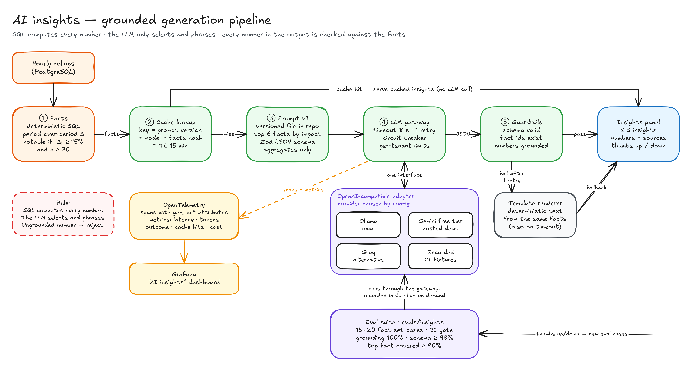
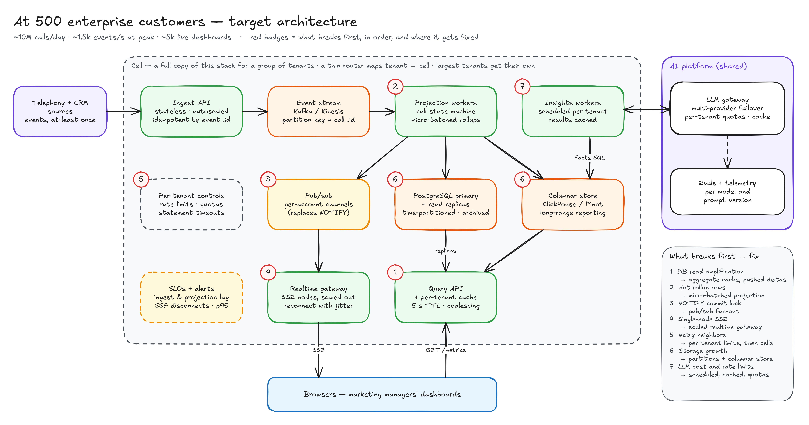

# Real-Time Call Analytics — Design & Decisions

**Author:** Umaraj Potla · **Date:** October 8, 2026 · **Status:** v1.1, as built. There was no kickoff call, so every assumption marked *Confirm* below is a stated assumption I'll walk through at the review. Changes made while building are in the [change log](#15-change-log).
**Repo:** [github.com/umarajPotla/call-analytics-dashboard](https://github.com/umarajPotla/call-analytics-dashboard) · **Live demo:** see the README · **Diagrams:** [`docs/diagrams/`](diagrams/) · **Runbook:** [`RUNBOOK.md`](RUNBOOK.md)

---

## 1. Summary

A real-time call analytics dashboard for a **marketing manager**. It answers four questions on one screen:

1. Are calls coming in right now, and is anything going wrong?
2. Which campaign sources produce calls that **convert**?
3. How did call volume trend this week, hour by hour and day by day?
4. How many calls are we **missing**?

**What's built:**
- **Ingest:** an idempotent ingest API writes call events to PostgreSQL in three forms: an append-only event log, a current-state table, and hourly rollups.
- **Serving:** a REST API serves the charts, and Server-Sent Events (SSE) push live updates to a React dashboard.
- **Test data:** a deterministic simulator produces realistic traffic, including duplicates, out-of-order events and late conversions.
- **AI insights:** one optional, grounded AI feature summarizes what changed. It runs behind a provider-agnostic LLM gateway, with evals, guardrails and telemetry.
- **Monitoring:** operational health is visible in Grafana dashboards provisioned as code.

Everything runs with one command (`docker compose up`) and costs $0.

**How this maps to Invoca's product.** In Invoca's terms, a *conversion* here is a signal (a sale, booking or quote) tied to the *campaign* and channel that drove the call, the live feed is the real-time view, and the "What changed" panel is close in spirit to Smart Alerts that flag missed calls and conversion drops. Two deliberate differences: every number and direction it states is checked against SQL facts before it's shown, and it suggests what to check rather than claiming *why* something happened, because explaining why needs conversation data, which is out of scope. Pushing those insights to marketers as alerts is a natural next step; the alerts built here are for operators.

## 2. Goals and non-goals

| Goals | Non-goals (intentionally left out) |
|---|---|
| Hourly and daily call volume for the last 7 days | Authentication/SSO. Tenant scoping is enforced, identity is stubbed |
| Conversion rate by campaign source, with a toggle to campaign | Call recordings, transcripts, speech analytics |
| Live feed of calls with status updating in place | Ad spend, cost per call, ROI (needs ad-platform data) |
| Filters by date range, campaign and outcome, shareable through the URL | Multi-touch attribution |
| Correct under real-world mess: duplicates, out-of-order events, late conversions, DST | Kafka, Kubernetes, microservices. Not needed at this scale; see the [scaling path](#11-scaling-path) |
| One grounded AI feature, built the way I'd build AI features on a shared platform | Text-to-SQL or free-form chat over data |
| Operable: health checks, metrics, dashboards, alerts | Mobile-specific layout (responsive basics only) |

## 3. Assumptions

*Confirm* = I'll raise it at the kickoff call. Each row says what changes if the assumption is wrong.

| ID | Assumption | If wrong |
|---|---|---|
| A1 | The user is a marketing manager at **one enterprise brand**. Agencies managing many brands are out of scope. *Confirm* | Add an account switcher and cross-account views. The data model is already multi-tenant |
| A2 | A conversion is either detected at call end or **arrives later** (offline/CRM import), up to **72 h** after the call. It is credited to the call's **start time and campaign**. *Confirm* | Widen the late-arrival window and extend the "rates may still rise" marker |
| A3 | **Conversion rate = converted ÷ resolved calls** (connected + missed + converted). Rate among answered calls is shown as a secondary number. *Confirm* | Swap the denominator. It's one function, `metrics.ts`, with tests |
| A4 | **Missed** = not answered by a person (no answer, voicemail, abandoned in the phone menu). A conversion reported for a missed call is **rejected and logged**. *Confirm* | Add a `voicemail` status, or accept the conversion. Both are local changes to the state machine |
| A5 | **Campaign source** = channel (Google Ads, Meta, TV, organic, direct mail, affiliate). Each campaign belongs to exactly one source | Add a source↔campaign mapping table |
| A6 | **"Last 7 days"** = 7 calendar days in the **account's time zone**, including today (partial). *Confirm* | Switch to a rolling 168 h window (one function) |
| A7 | Freshness targets: live feed **≤ 3 s p95** end to end; charts **≤ 10 s** | Tighter targets mean pushing aggregates instead of throttled refetch (see D7) |
| A8 | Each call has **one** campaign (single-touch, from the tracking number) | Multi-touch needs a call↔touchpoint table and weighting rules |
| A9 | Account time zones have **whole-hour UTC offsets** for accurate daily totals | Move rollups to 15-minute buckets (4× rows) |
| A10 | Demo scale: **3 accounts**, ~1.5–4k calls/day each, 14 days of history. Performance is benchmarked separately at **~10M calls / 500 accounts** | — |
| A11 | **Synthetic data only.** No real PII; caller numbers are masked at ingest | Real data needs encryption at rest, access controls, retention policies |
| A12 | Reviewers run it with **Docker only** (macOS/Linux). The hosted link is a convenience and may cold-start | Add a no-Docker path (`pnpm dev` + local Postgres) |
| A13 | Free LLM tiers are acceptable **for synthetic, aggregate data only** | Production needs enterprise / zero-retention terms or a self-hosted model |

## 4. Metric definitions

Each call has exactly one status at a time: `ringing` (in progress) → `connected` | `missed` → `converted`.

| Metric | Definition | Notes |
|---|---|---|
| Total calls | Calls whose **start time** falls in the range | Always bucketed by call start, never by conversion time |
| Resolved calls | connected + missed + converted | Excludes in-progress calls so live calls don't lower the rates |
| Answer rate | (connected + converted) ÷ resolved | |
| Conversion rate | converted ÷ resolved | "—" when resolved = 0, never 0% or NaN |
| Conversion rate (of answered) | converted ÷ (connected + converted) | Secondary, shown in the tooltip |
| Low-volume flag | resolved < 30 | Badge in the UI. The AI insights never treat these as notable |
| Conversion maturity | Last 3 days may still gain late conversions | Subtle "may still update" marker |

## 5. Architecture

Editable source: [`diagrams/01-architecture.excalidraw`](diagrams/01-architecture.excalidraw) (open at excalidraw.com).

| Component | Responsibility |
|---|---|
| **Web app** (React) | Filters ↔ URL, cached data fetching, charts, live feed, insights panel. No metric math in the browser |
| **REST API** (Fastify) | Tenant-scoped reads over rollups and calls; validation; OpenAPI; problem+json errors |
| **Ingest service** | Validate → dedupe → state machine → update projection + rollup **in one transaction** → notify |
| **SSE hub** | One `LISTEN` per instance; per-account fan-out; heartbeats; replay on reconnect; backpressure |
| **Insights service** | Deterministic facts (SQL) → LLM gateway → guardrails → cache; template fallback |
| **Simulator** | Seeded, realistic live traffic sent **through the public ingest API**; history is bulk-loaded like a data import (D11) |
| **PostgreSQL** | `call_events` (log), `calls` (current state), `call_stats_hourly` (rollup), `insight_*` (cache, feedback) |
| **Observability** | Prometheus metrics → Grafana (four dashboards) and Prometheus alert rules, all provisioned from the repo |
| **External** | LLM provider (Ollama locally / Gemini free tier hosted). Future: telephony and CRM feeds |

**Main flows**

1. **Ingest:** `POST /api/v1/call-events` → one transaction per event: take a per-call advisory lock, insert the event (`ON CONFLICT DO NOTHING`), apply the state transition, upsert the call, apply ±1 deltas to the hourly rollup, `pg_notify` → `200` with an outcome per event (`applied`, `duplicate`, `noop`, `rejected`).
2. **Charts:** `GET …/metrics/*` reads `call_stats_hourly` (≈168 rows × campaigns per week) and returns zero-filled buckets.
3. **Live:** `NOTIFY` → hub → `event: call.updated` to that account's clients → the browser upserts the feed row and **throttles** a chart refetch (≤ once per 5 s).
4. **Reconnect:** the browser sends `Last-Event-ID` → the server replays events with a higher sequence number (bounded, with a small overlap) → the client dedupes.

## 6. Decisions

Format: **Decision** → why → trade-off I accept → when I'd revisit.

| ID | Decision (one line) |
|---|---|
| D1 | TypeScript end to end: Node.js 24 LTS + Fastify, React 19 + Vite + TanStack Query + Recharts, Zod schemas shared |
| D2 | pnpm monorepo: `apps/api`, `apps/web`, `packages/shared`; hexagonal-lite layering |
| D3 | PostgreSQL 17 as the only datastore |
| D4 | Event log → current-state projection → hourly rollup, maintained transactionally |
| D5 | At-least-once ingest made idempotent by `event_id`; rank-based state machine tolerates out-of-order events |
| D6 | Server-Sent Events for live updates, fanned out via Postgres `LISTEN/NOTIFY`; polling fallback |
| D7 | Charts refresh by throttled refetch on events; the server rollup is the single source of truth |
| D8 | Store UTC; bucket by UTC hour; group into days in the account's time zone |
| D9 | Multi-tenant from day one: `account_id` on every row and query |
| D10 | REST `/api/v1` + OpenAPI + RFC 9457 errors + keyset pagination |
| D11 | Deterministic simulator that uses the public ingest API |
| D12 | AI insights: deterministic facts + LLM phrasing + grounding checks + evals, behind a provider-agnostic gateway |
| D13 | Prometheus metrics → Grafana, dashboards and alerts as code. Grafana is for operators, not customers |
| D14 | Docker Compose locally (with profiles); Render + Neon free tiers for the hosted demo |
| D15 | Test where the risk is: state machine, rollup math, time bucketing, tenancy, SSE, LLM guardrails |

**D1 — TypeScript end to end.** One language across client, server and shared contracts. Zod schemas generate both runtime validation and the OpenAPI spec, so the API contract can't drift. Node.js 24 is the supported LTS line (to April 2028); I'd move to Node 26 after it enters LTS in late October 2026.
*Trade-off:* Invoca's core backend is Rails. Inside an existing codebase I'd follow house conventions (Rails, GraphQL/Apollo). For a 3-day greenfield build I chose the stack I can explain line by line.

**D2 — Monorepo with hexagonal-lite layering.** The domain logic (the call state machine, metric definitions in `packages/shared`, the insight fact rules and guardrails) is pure and framework-free and unit-tested. Routes are thin adapters with no SQL. SQL lives in the repositories (`read/`) and in the services that own a transaction (ingest, insights). Another engineer can find and change one concern without reading the whole system.

**D3 — PostgreSQL only.** Transactions make ingest atomic. `LISTEN/NOTIFY` covers fan-out at this scale. Window functions and `generate_series` cover the analytics.
*Rejected:* a time-series extension (TimescaleDB's continuous aggregates aren't available on the managed host), a separate OLAP store, Redis. Each would add a moving part without a measured need.
*Revisit:* when dashboard reads compete with ingest writes (see §11).

**D4 — Event log → projection → rollup.**
- `call_events` keeps the audit trail and the replay cursor for SSE.
- `calls` holds the current state of each call.
- `call_stats_hourly` holds one row per account × campaign × UTC hour, so a 7-day chart reads hundreds of rows, not hundreds of thousands.
- A status change is −1 on the old status column and +1 on the new one, in the bucket of the call's **start hour**.

*Trade-off:* the rollup is a second representation that could drift. Mitigations: a property-based reconciliation test, a `rebuild-rollups` command, and a scheduled drift check exported as a metric and alerted on.

**D5 — Idempotent, order-tolerant ingest.**
- Delivery is at-least-once. The unique `event_id` makes processing effectively-once.
- Events carry the call's identity fields (account, campaign, start time), so a `converted` event can arrive before `answered`.
- Transitions only move forward by rank (ringing 0 → connected/missed 1 → converted 2). Stale events are no-ops. Invalid ones (a conversion on a missed call, per A4) are kept with `applied = false` and counted.

**D6 — SSE over WebSockets.** The need is one-way, server → browser. SSE is plain HTTP, the browser reconnects automatically with `Last-Event-ID`, it works through standard proxies, and you can test it with `curl`.
- Heartbeats every 20 s.
- A bounded per-client queue: a slow client is disconnected and resyncs, so it never affects others.
- Graceful drain on deploy.
- Fallback: polling `GET …/calls/changes?afterSeq=<seq>` with the same cursor. The client keeps the cursor from the stream's event ids and the endpoint's `latestSeq`, and the first page of calls returns the sequence it was read at (`asOfSeq`), so nothing falls between the page and the stream.

Known subtlety: sequence numbers are assigned at insert, not commit, so replay uses a small overlap window and the client dedupes.

**D7 — Throttled refetch instead of client-side aggregation.** Recomputing charts in the browser from individual events would duplicate the metric logic and drift. A refetch at most every 5 s per open dashboard is cheap at demo scale.
*Revisit:* at scale this is the first thing to break (read amplification); the fix is a server-side aggregate cache plus pushed "stats changed" events (§11).

**D8 — Time.** `timestamptz` in UTC; rollups are UTC hours; daily views group hours into **local days** in the account's IANA time zone, which is correct for 23- and 25-hour DST days. Ranges are half-open `[from, to)`. Buckets are zero-filled on the server. Postgres does the zone math, and every query names its zone, so results never depend on the server's or the session's zone (the integration tests run their sessions in UTC+13:45 to prove it). Tests cover the US (Nov 1, 2026) and UK (Oct 25, 2026) DST weeks.
*Comparisons are like for like:* "this week so far" is compared with last week **up to the same local time**, and last week's conversions are counted **as they were known at the same point**, because the current week is still collecting late conversions. Without this, every dashboard would show a false drop in conversion rate every day.
*Known limitation:* half-hour-offset zones (A9).

**D9 — Multi-tenancy.** Every table carries `account_id`. The tenant is in the URL path and checked by authorization middleware (stubbed identity, real scoping). Tests assert account A can never read account B. Postgres row-level security is the production defense in depth.

**D10 — API.** Versioned REST under `/api/v1`, OpenAPI at `/api/docs`, RFC 9457 problem+json errors, input validation on every route. Keyset pagination on `(started_at, id)` stays stable while new calls stream in. Hourly ranges are capped at 31 days. Metrics responses send `Cache-Control: private, max-age=5`.

**D11 — Simulator through the front door.**
- **Realistic traffic:** arrivals follow business-hour and weekday curves per account time zone; answer rates drop after hours; conversion varies by campaign and rises with call duration; durations are log-normal; ~35% of conversions arrive late (up to 72 h). Each campaign also drifts slowly on its own multi-week cycle, so week-over-week comparisons contain real changes for the insights to find, not just noise.
- **Deterministic:** seeded per minute, so any window regenerates identically, and event ids are deterministic, so re-sending is idempotent.
- **Self-healing on cold start:** it loads history on boot and catches up after the free host sleeps.
- **Chaos knobs:** duplicates (~2%) and reordering (~1%) prove idempotency live; a demo control multiplies one account's traffic 6× for 10 minutes.

**Live** events go through the public ingest API, so swapping in a real telephony feed is a configuration change. *Trade-off:* **history** (14 days, ~100k calls) is bulk-loaded set-based, like an initial data import, using the same state machine, then the rollup is rebuilt from it. Pushing it through per-event transactions against a free remote database would take far too long on every cold start.

**D12 — AI insights: grounded, measured, replaceable** (details in §7). The LLM **never computes numbers and never writes SQL**. SQL computes the facts; the model only selects and phrases them, and every number it outputs is checked against those facts.
*Trade-off:* less "magic" than free-form chat. In exchange, the output is verifiable, cheap, testable in CI and degrades gracefully to deterministic text.

**D13 — Observability as code.**
- **Instrumentation:** the official Prometheus client (`@prometheus-io/client`), exposed at `/metrics`, plus structured JSON logs. I chose plain Prometheus over the OpenTelemetry SDK for this build: one process and no collector means less to run for the same dashboards. Tracing is the next step (one span per request and per LLM call, GenAI attributes).
- **Grafana (self-hosted, free):** data sources and four dashboards are provisioned from `ops/grafana/` (generated by a script, `pnpm dashboards`); alert rules live in `ops/prometheus/alerts.yml` with runbook links. `docker compose --profile observability up` gives a working ops view with zero clicks, and CI checks that it does.
- **Hosted option:** Grafana Cloud's free tier (no card; 10k active metric series, 14-day retention).

*Why not build the customer dashboard in Grafana:* the product view needs tenant-aware access, metric semantics (resolved vs answered, maturity markers), a live feed that updates in place, and UX made for a non-technical user. Grafana is the right tool for **operators**; the React app is for **Maya**. Grafana also gets an internal **Business overview** dashboard that reads Postgres through a read-only role; its numbers must match the product UI, which makes it a cross-check as well as a quick internal view.

**D14 — Runs anywhere for $0.**
- **Local:** `docker compose up` (Postgres plus one image serving API, simulator and dashboard). Optional profile `observability` adds Prometheus and Grafana. AI: point `LLM_BASE_URL` at Ollama running natively on the host (Apple-silicon acceleration), reached as `host.docker.internal`.
- **Hosted:** Render free web service serving the API and the built SPA from one origin (`render.yaml` Blueprint), plus Neon free Postgres. The app runs behind Neon's transaction-mode pooler: no session settings, and the two things that need a real session (migrations' advisory lock and `LISTEN`) use the direct URL.
- *Rejected:* Render's free Postgres (expires after 30 days), Fly.io and Railway (trial only), serverless functions for SSE (duration caps).
- **Neon's limits:** no keep-alive pinger, so Neon's free compute hours aren't burned.

**D15 — Testing.** See §9.

## 7. AI insights — platform design

**User value.** A marketing manager shouldn't have to stare at charts to notice that something changed. The panel shows up to three short, sourced insights for the selected account and range, for example:

> **Missed calls from TV · Fall Spot up 38% vs last week (212 vs 154)**, concentrated on weekdays 12–2 pm. Consider overflow routing or extra staff in that window. *Sources: 3 metrics*

**Pipeline**

1. **Facts (deterministic SQL).** Like-for-like period-over-period changes (D8) in volume, missed calls and conversion rate for the account, each source and each campaign, plus the local 2-hour window with the most *excess* missed calls. Each fact gets a stable id and pre-formatted numbers. A fact is **notable** only if it is both big enough to matter and unlikely to be noise:
   - counts: |Δ| ≥ 15%, ≥ 30 in both periods, and a Poisson z ≥ 3
   - rates: |Δ| ≥ 2 points, ≥ 30 resolved calls in both periods, and a two-proportion |z| ≥ 3
   - *Why z ≥ 3, not the textbook 2:* one view tests ~50 facts at once. At z ≥ 2 that's ~2 false alarms per view from noise alone; at z ≥ 3 it's ~0.1 (a Bonferroni-style correction). I found this by running the first version against the simulator: it confidently reported changes that were pure noise.
2. **Selection.** Every fact's impact is in one unit, **estimated conversions gained or lost** (Δcalls × conversion rate, Δmissed × conversion rate of answered calls, Δrate × resolved calls), so a volume spike and a conversion drop can be ranked fairly. Only notable facts reach the model, the top 8 by impact, so the prompt stays small and the cost bounded. If nothing is notable, the model is not called at all.
3. **Generation.** A versioned prompt (`prompts/insights.v2.md`; v1 is kept for comparison) asks for JSON matching a Zod schema: `{ insights: [{ title ≤ 80 chars, body ≤ 240 chars, factIds[1–4], action? }] }`, at most 3 insights. The model sees only ids, labels, each fact's direction and pre-formatted numbers: aggregates, never calls or callers.
4. **Guardrails** (deterministic, `guardrails.ts`).
   - The output must parse as JSON (a Markdown fence is tolerated) and match the schema.
   - Every cited fact must exist **and be notable**.
   - **Every number in the text must appear in the facts that insight cites** (normalized: `1,234` = `1234`, `20.0%` = `20%`).
   - **Directions must match:** "up"/"down" words must agree with the directions of the cited facts, facts that moved in different directions can't be lumped into one claim, and a fact's change figure can't sit next to the opposite direction word.
   - **Mentions must be cited:** every campaign or source named in the text must be one the insight cites (whole-name matching, so "Brand search" isn't found inside "Non-brand search").
   - *Why the last two exist:* the first live eval (llama3.2:3b, prompt v1, on a MacBook Air) produced answers where **every number was right and the story was wrong**: "Meta calls up 34%" for a 34% drop, or "conversion decreased across Google Ads, Brand search and Meta" when Meta rose. Number grounding alone let them through. The recorded answers are now replayed in CI against the guardrails, which reject all of them (9 of 23 recorded answers; see `apps/api/evals/`).
   - On failure: one repair round with the exact errors fed back, then **fallback** to a deterministic template rendered from the same facts (which passes the guardrails by construction, and a test proves it).
5. **Caching and cost control.**
   - A **15-minute freshness window** per (account, range, prompt version, model): live data moves every second, so without it the facts would never be identical twice. Insights are **never regenerated per live event**.
   - A **content-addressed key** = hash(prompt version, model, facts): identical facts never pay for a second generation.
   - **Single-flight** coalescing, a **per-account hourly budget** of model calls (then the template answers), and template answers given because the model was down are cached for only 60 s so the model is retried soon.
6. **Feedback.** Every generation is stored **immutably** with its own id. 👍/👎 refers to that id and stores the prompt version, the model, and a snapshot of the insight and the facts it cited, exactly as the user saw them, so a thumbs-down can become an eval case without guesswork.

**LLM gateway.** A small `LlmProvider` interface with a single **OpenAI-compatible adapter**, configured by environment variables (`LLM_BASE_URL`, `LLM_MODEL`, `LLM_API_KEY`). The `InsightGenerator` (facts in, insights out, no database) is the exact code path that both production and the eval harness run.

| Environment | Provider | Why |
|---|---|---|
| Local | **Ollama** (`http://localhost:11434/v1`) | Free, offline, nothing leaves the laptop |
| Hosted demo | **Gemini API free tier** (OpenAI-compatible endpoint) | Free, fast; synthetic aggregate data only (free-tier content may be used to improve Google's products) |
| Alternative | Groq free tier | Same adapter, swap by config |
| CI | **Recorded provider** (fixtures) | Deterministic, free, no network |
| Disabled | **Template provider** | Feature still works with no LLM at all |

The gateway also owns **timeouts** (8 s hosted; 20 s by default for a local model, which loads on first use), **one retry** on transient errors (5xx, 429, network; not on timeouts, because the user already waited), a **circuit breaker** (open after 5 failures in 60 s, one trial request after 30 s), and **metering** (latency, tokens, estimated cost). Adding a second AI feature means reusing the gateway, the prompt files, the eval harness and the guardrail helpers. That's the platform point.

**Evals** (`apps/api/src/insights/eval/`, run with `pnpm eval`)

- **Cases:** realistic weeks of counts turned into facts by the **same rules production uses**: a conversion drop, a TV volume spike, a quiet week, low-volume noise next to a real change, mixed directions, evening misses, and a busy week with more signals than fit.
- **Guardrail probes:** model outputs that must be rejected (an invented number, a number borrowed from a fact the insight doesn't cite, an unknown or noisy fact, too many insights, too long, prose instead of JSON) and outputs that must be accepted (fenced JSON, a null action), so the checks can't quietly become too strict either.
- **Scoring beyond the guardrails:**

| Check | Gate |
|---|---|
| **Guardrail probes behave as expected** | **100% (hard gate, CI)** |
| Never cites a low-volume or noisy fact | 0 violations |
| Never states the wrong direction of a change ("up" for a drop) | 0 violations |
| Quiet periods answered without calling the model | 100% |
| Key findings covered | 100% template, ≥ 80% model |
| Template fallbacks when the model is asked | ≤ 10% |
| Latency p50/p95, tokens per case | Reported, not gated |

- **CI** runs the probes, the template answers, and re-checks **every recorded real model answer against today's guardrails** ("would this answer reach a user now?"), then scores the accepted ones independently: free, deterministic, no network.
- **Live runs** (`pnpm eval --live --runs 3 --record`) run the cases against the configured model, write a results file to `apps/api/evals/results/`, and record the raw answers for replay in CI.

**Live results so far** (7 cases × 3 runs; quiet weeks never call the model):

| Model · prompt | Model calls | First try OK | Repaired | Template fallback | Key findings covered | Latency p50 / p95 |
|---|---|---|---|---|---|---|
| llama3.2:3b (local, MacBook Air) · v1, number checks only | 18 | 13 | 3 | 2 | 98% | 4.0 s / 11.6 s |

Re-checked against today's guardrails, 14 of those 23 raw answers would still reach a user. All 9 rejections are real problems: wrong or lumped-together directions, channels named without being cited, a body over the length limit, an invented number. That is exactly the failure mode prompt v2 and the two new checks target.

**Telemetry.**
- Metrics: generations by outcome (`ok`, `repaired`, `invalid`, `timeout`, `error`, `circuit_open`, `rate_limited`, `no_llm`, `no_signal`), guardrail rejections by check, LLM latency, tokens, estimated cost from a price table ($0 on free tiers, but the mechanism exists), cache hits (fresh / content / miss), and feedback.
- These appear in the Grafana "AI insights" dashboard, with an alert when more than 20% of generations fall back. Guardrail rejections are logged with their reasons; prompts and responses are not logged.

**Next (not built):** "Ask the dashboard" — natural language → a **validated filter object** through tool calling (never SQL), evaluated by exact match on a golden set of queries.

## 8. Observability

| Dashboard (provisioned) | Panels |
|---|---|
| **Service health** | API up; requests/s and p95 latency by route; 5xx rate; ingested events by outcome; **ingest lag** p50/p95 (event occurred → stored); live-feed connections and disconnects by reason; event-loop lag, memory, CPU |
| **AI insights** | Generations by outcome; fallback rate; grounded-first-try rate; LLM latency p50/p95; tokens; cache hit rate; guardrail rejections by check; estimated spend; feedback |
| **Data correctness** | Rollup drift buckets (must be 0); duplicates absorbed; out-of-order no-ops; rejections by reason |
| **Business overview (SQL)** | Calls, conversion and answer rate, missed calls, calls per hour by status, conversion by source, latest calls, per account, read through a read-only Postgres role |

**Alerts (Prometheus rules, each with a runbook link):** API down · ingest lag p95 > 10 s · rollup drift > 0 · 5xx rate > 2% · slow-client disconnects > 5% · insight fallback rate > 20%. See [`RUNBOOK.md`](RUNBOOK.md).
**Logs:** structured JSON (pino), secrets redacted at the source; per-request logs only at debug level, because latency and status go to metrics; caller numbers are never logged.
**Health:** `/healthz` (process up) and `/readyz` (database reachable), used by the Docker healthcheck and Render.

## 9. Testing and quality

| Layer | Tooling | What it proves |
|---|---|---|
| Unit | Vitest | Every state-machine transition (including stale and rejected); metric math (zero denominators, low volume); fact rules (thresholds, ranking, peak window); gateway (retry, timeout, circuit breaker); generator (repair round, fallbacks); the live-feed merge (dedupe, in-place updates, out-of-order) |
| Property-based | fast-check | Random lifecycles + shuffled order + duplicates + concurrent streams ⇒ rollup equals a fresh recount |
| Integration | Vitest + real Postgres | Idempotency; late conversions; **tenant isolation**, even when asked for another tenant's campaign ids; keyset pagination; totals agree across endpoints; DST weeks (US and UK); like-for-like comparisons with late conversions; every query is independent of the session time zone |
| API contract | Fastify `inject` | Validation with field paths, problem+json errors, range limits, OpenAPI document |
| SSE | Integration (real HTTP) | Push after commit, `Last-Event-ID` replay of the current state, campaign filtering |
| AI | Eval suite (`pnpm eval`) | Guardrail probes (hallucinated numbers, wrong directions, uncited channels, format failures), template answers, every recorded real model answer re-checked against today's guardrails; live runs on demand |
| E2E smoke | Playwright, against `docker compose up` | Loads, live feed connects, a traffic spike shows new calls, filters update the URL and survive reload, insights render |

**CI (GitHub Actions, every push to `main` and every pull request):** lint → typecheck → unit → evals → integration (Postgres service) → build the Docker image and start the stack with `docker compose` → Playwright smoke test → start Prometheus and Grafana and check that the alert rules load, the API is scraped and all dashboards are provisioned.
**Benchmark** ([`benchmarks.md`](benchmarks.md), `pnpm bench`): 9.7M calls across 500 accounts. For an enterprise-sized account the 7-day hourly chart takes ~1 ms from the rollup vs ~65–70 ms aggregating raw calls (roughly 50× across runs). Ingest through the real service peaks at ~1.4–1.7k events/s on a 2-vCPU database: right at the 500-customer peak in §11, which is why batching projection is the next scaling step.

## 10. Security and privacy

- Tenant scoping on every query, plus isolation tests. Row-level security is the production next step.
- Caller numbers are masked at ingest and never stored raw. Only aggregates are sent to LLMs. No raw PII in logs.
- Validation on every endpoint, a 1 MB body limit and at most 500 events per ingest request; same-origin hosting, so no CORS surface. Rate limiting is the next step for a public ingest endpoint.
- Authentication is stubbed (a non-goal, §2): every request acts as a demo user who may see the demo accounts. The tenant guard is real.
- The container runs as a non-root user. Secrets come only from environment variables (`.env.example` and `render.yaml` hold none). Free LLM tiers are used for synthetic data only (A13).

## 11. Scaling path

**Assumptions for "500 enterprise customers":** ~20k calls/customer/day → ~10M calls/day (~115/s average, ~500/s peak, ~1.5k events/s); ~10 concurrent viewers per customer → ~5k open SSE connections.

**What breaks first, in order:**

1. **Read amplification on the primary database.** Every live event triggers throttled refetches from every open dashboard of that account; at ~5k viewers that's 1k+ aggregate queries/s competing with ingest writes.
   → Server-side aggregate cache keyed by (account, filters) with a ~5 s TTL and request coalescing; push a lightweight "stats changed" event; a read replica for dashboards.
2. **Hot rollup rows.** One busy campaign means many transactions updating the same hourly row.
   → Put a queue between ingest and projection; projection workers **micro-batch** rollup deltas (aggregate per second, write once).
3. **`LISTEN/NOTIFY` under heavy write concurrency.** Committing a transaction that issued `NOTIFY` takes a global lock to preserve commit order.
   → Move fan-out to a pub/sub layer or the event stream.
4. **Single-node SSE fan-out.**
   → A dedicated, horizontally scaled realtime gateway subscribed to per-account channels, with reconnect jitter.
5. **Noisy neighbors.**
   → Per-tenant rate limits and statement timeouts, then **cell-based** sharding (largest tenants get their own cell).
6. **Storage growth.**
   → Time-partitioned tables, archival, a columnar store for long-range reporting.
7. **LLM cost and rate limits** (12k+ generations/day if hourly per tenant).
   → Precompute on a schedule, cache by facts hash, smaller models for routine summaries, per-tenant quotas, multi-provider failover in the gateway.

**Evolution:** v0 (this build) → v1 (~50 customers: replicas, aggregate cache, pushed deltas) → v2 (~500: event stream, projection workers, realtime gateway, OLAP, per-tenant limits) → v3 (cells, regional data residency). Each step is triggered by a measured symptom, not added ahead of need.

## 12. Delivery

Planned as three days with a kickoff on day 0; delivered in two without one.

| When | Delivered |
|---|---|
| Day 1 | Design and assumptions; schema, state machine and idempotent ingest with property tests; simulator; read APIs; SSE live feed; AI insights with guardrails and evals; the React dashboard |
| Day 2 | Docker image and Compose stack; Prometheus alerts and Grafana dashboards as code; CI that runs the stack end to end; DST and like-for-like tests; benchmark; diagrams, runbook, README; hosted demo |

**Cut order, as planned:** hosted Grafana → live LLM on the hosted demo (the template fallback stays) → benchmark → E2E tests. **Cut:** hosted Grafana only.
**Never cut:** the four core features, ingest correctness tests, the decision summary, the diagram, the one-command run.

## 13. How I use AI tools while building

- **Design first:** this document, the metric definitions and the state machine come before any generated code.
- **Small, reviewable slices:** code is generated one module at a time and reviewed as a teammate's PR would be, then committed in small, described commits.
- **Tests as the contract:** the high-risk behaviour (idempotency, ordering, rollup reconciliation, tenant isolation, time zones, grounding) is pinned by tests, and CI runs the whole stack the way a reviewer would.
- **Run it, look at it, question it:** several of the most important decisions in the change log came from running the system and noticing that a number was wrong or misleading, not from the generated code.
- **Fresh-eyes review:** before submitting, a separate AI agent that hadn't seen the work reviewed the code against this document. Its findings, and what changed because of them, are in the change log.
- **A running log:** the README says how AI was used and where to look hardest.

## 14. Questions I'd have asked at a kickoff

There was no kickoff call, so these are stated as assumptions (§3) and are the first things I'll walk through at the review.

1. Who exactly is the user: one brand's marketing manager, or an agency? (A1)
2. When does a call count as converted, and how late can a conversion arrive? (A2)
3. Should conversion rate be out of all calls or answered calls? (A3)
4. Does a voicemail count as missed, and can a missed call later convert? (A4)
5. Is "last 7 days" calendar days in the account's time zone, or a rolling 168 hours? (A6)
6. How real-time is real-time for you: seconds for the feed, minutes for charts? (A7)
7. Anything you'd like to see more of: testing depth, infra, UX, or AI?

## 15. Change log

| Date | Change | Reason |
|---|---|---|
| 2026-10-07 | v1.0 | Initial decisions and assumptions |
| 2026-10-08 | No kickoff call: every *Confirm* assumption stands as written | Covered at the review instead (§14) |
| 2026-10-08 | **Like-for-like comparisons**: a partial period is compared with the previous one cut at the same local time, and the previous period's conversions are counted as known at the same point (D8) | Running the first version, every week looked worse than the last: today is partial and the last 72 h haven't collected their late conversions yet |
| 2026-10-08 | Insight notability **z ≥ 3** plus effect-size floors; ranking in **estimated conversions** (§7) | At z ≥ 2 the first version confidently reported pure noise (~50 facts tested per view); ranking by change × volume mixed incomparable units |
| 2026-10-08 | Two-level insight cache: **15-min freshness window** + facts-hash key (§7) | With live data the facts change every second, so a facts-hash key alone would almost never hit |
| 2026-10-08 | Prometheus client instead of the OpenTelemetry SDK (D13) | Same dashboards with less to run; tracing is the next step |
| 2026-10-08 | Simulator history is **bulk-loaded**; live traffic still goes through the ingest API (D11) | ~100k calls per cold start through per-event transactions on a free remote database is too slow |
| 2026-10-08 | Simulator runs **in-process** (diagram 1 said "container locally"); a standalone CLI also exists | One service on the free host; nothing to orchestrate locally |
| 2026-10-08 | KPI tiles and conversion rates **ignore the outcome filter**, and say so in the UI and API (`ignoredFilters`) | "Conversion rate of missed calls only" is meaningless; silently applying the filter would mislead |
| 2026-10-08 | Ingest returns **200 with an outcome per event** instead of 202 | The sender learns synchronously which events were duplicates, no-ops or rejected |
| 2026-10-08 | Runs behind Neon's transaction-mode pooler: no session settings; direct URL for migrations and `LISTEN` (D14) | Poolers reject startup options and don't keep session state |
| 2026-10-08 | Fourth Grafana dashboard: business overview through a read-only role | Cross-checks the product's numbers; useful internal view |
| 2026-10-08 | Benchmark measured at 9.7M calls / 500 accounts ([`benchmarks.md`](benchmarks.md)) | Confirms the rollup design (roughly 50× faster chart reads) and puts a number on the first ingest limit (~1.5k events/s per small database) |
| 2026-10-08 | **Direction and mention guardrails**, prompt **v2** with explicit fact directions (§7) | The first live eval showed correct numbers with wrong directions; number grounding alone let them through |
| 2026-10-08 | Every insight generation is **immutable**, with a separate freshness-window table; feedback refers to a generation id | An independent review found that a regeneration could overwrite the text a thumbs-down was about, and that ranges with identical facts overwrote each other's window |
| 2026-10-08 | KPI tiles now compare like for like too (D8); "may still convert" marker based on now − 72 h, not the end of the range | Same review: only the insights used as-of comparisons, and the marker showed on ranges long finished |
| 2026-10-08 | Compose publishes Postgres on `127.0.0.1:5433` | 5432 clashes with a Postgres already running on a reviewer's machine |
| 2026-10-08 | **Cut:** hosted Grafana | Time; first in the planned cut order (§12). Grafana runs locally with one command |
